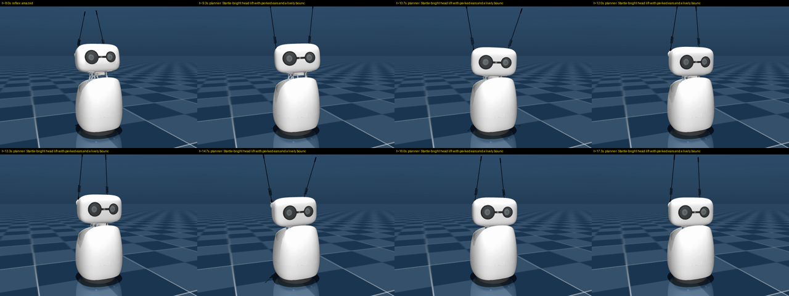

# Reachy-Motion

**Talk with Reachy Mini — it moves with what it says, in real time.**

[繁體中文說明](README_zh-TW.md) · [Knowledge base (Obsidian wiki)](wiki/_Index.md)

Reachy-Motion is a live voice-chat app for the [Reachy Mini](https://github.com/pollen-robotics/reachy_mini) robot.
While the robot speaks, every clause of its reply is turned into an expressive gesture (head, antennas, body) that
lands together with the audio, on top of idle breathing and speech-driven head sway. It builds on Binh Pham's
[expressive motion harness](https://garden.binhph.am/articles/the-best-expressive-harness-for-robots): his motion
*recipe* language and the [`reachy-animation`](https://github.com/pham-tuan-binh/reachy-animation) animator.



## Three voice modes

| Mode | Voice | How text reaches the director | Reply latency (measured) |
|---|---|---|---|
| `gpt-live` | OpenAI **GPT-Live-1** (full duplex) | output transcript, ~0.3 s *after* its audio | instant |
| `elevenlabs` | **ElevenLabs Agent** with an **Eleven v4 Turbo** voice | per-chunk character alignment, ahead of playback | ~1–2 s |
| `taigi` | **台語 / Taiwanese Hokkien**, fully local: Breeze-ASR-26 → SARC-Taigi-LLM-12b → KaedeTai GPT-SoVITS | whole sentences, before TTS | ~1.7 s warm |

Switch modes live from the settings page (`http://<host>:8042`) — or just ask: 「換成台語」, "switch to GPT live".

## Reachy as an embodied agent (v0.2)

A small **body agent** (an LLM with tools) listens to every utterance and acts on the robot, while the voice model
keeps talking — see [Body Agent](wiki/architecture/Body%20Agent.md):

- **Spoken control** — switch voice mode, volume up/down (「我聽不太清楚」 works too), look at me / stop staring.
- **Eyes** — 「你看到什麼？」「我手上拿的是什麼？」: a camera frame goes to a vision model, the voice answers.
- **Web** — weather, news, prices: OpenAI web search, answered in the current voice (even in 台語).
- **Looks at you** — daemon face tracking blended under the gestures; **knows it has a body** and today's date.
- **台語 on demand** — the robot finds a Mac sharing the Taiwanese models on the LAN (`reachy-motion-node`, mDNS),
  or tells you what is missing.

## How gestures stay in sync

```
voice mode ──audio──▶ Speaker (playback clock) ──chunks──▶ Animator.feed_speech  (speech sway)
     └──────text────▶ Director ── reflex (0 ms) / reaction / LLM planner (~1.2 s) ──▶ recipe ──▶ Animator.play
                                   scheduled at speaker.time_of(position of that text)            │
                                                                     robot.set_target(...) ◀── 60 Hz
```

- **Reflexes**: cue words (哈哈 / 哇 / 不行 / 對 / sorry / ? …) fire a gesture the instant a clause starts.
- **Planner**: an LLM (default `gpt-5.4-nano`) writes a motion recipe for each clause, e.g.
  `go .25 e=40 p=4 | osc 1.2 y 12 .55 E=2.2 | go .35 e=25 p=3 E=1` for 「不行啦，那樣太危險了。」
- **Reactions** (GPT-Live): since GPT-Live answers instantly, the robot's first reaction is planned *while you are
  still talking*.
- Each gesture is placed on the **speaker's playback clock**, so it starts with the words it belongs to.

Details: [Architecture](wiki/architecture/Architecture.md) · [Playback Clock](wiki/architecture/Playback%20Clock.md) ·
[Gesture Director](wiki/architecture/Gesture%20Director.md) · [Latency measurements](wiki/findings/Latency%20Measurements.md)

## Install

```bash
git clone https://github.com/dAAAb/Reachy-Motion && cd Reachy-Motion
uv venv -p 3.12 && uv pip install -e .        # or: python -m venv .venv && pip install -e .
cp .env.example .env                          # add OPENAI_API_KEY, ELEVENLABS_AGENT_ID, ...
```

## Run

```bash
# on a computer, robot over Wi-Fi, this computer's mic + speaker (recommended for the Taiwanese mode)
reachy-motion --mode elevenlabs --audio local

# no robot: watch the motion in the browser preview at http://127.0.0.1:8042
reachy-motion --mode gpt-live --no-robot

# MuJoCo simulator:   reachy-mini-daemon --sim   then   reachy-motion --sim
```

**On the robot** (Reachy Mini Wireless) it is a standard `ReachyMiniApp` (entry point `reachy_motion`) and runs
entirely on the robot with its own mic and speaker — no computer needed for GPT-Live / ElevenLabs:

```bash
/venvs/apps_venv/bin/pip install "git+https://github.com/dAAAb/Reachy-Motion"   # on the robot
# keys + settings in ~/.config/reachy_motion/.env (see .env.example), then start it from the dashboard
```
Details and robot gotchas: [Running on the Robot](wiki/architecture/Running%20on%20the%20Robot.md).

Local laptop audio runs **half duplex** by default (the mic is muted while the robot talks, so it doesn't hear
itself); use a headset and `--no-half-duplex` for barge-in.

### Taiwanese mode

Runs on an Apple-Silicon Mac: `reachy-motion-asr` (Breeze-ASR-26 on MLX, `pip install -e ".[asr]"`), Ollama with
`SARC-Taigi-LLM-12b`, and KaedeTai GPT-SoVITS. Start `reachy-motion-node` (`.[node]`) to share them on the LAN — the
robot finds them by itself. See [Taigi Local Pipeline](wiki/voices/Taigi%20Local%20Pipeline.md).
No weights or reference audio are shipped here.

## Record a session without a robot

```bash
pip install -e ".[record]"
python scripts/record_session.py --mode gpt-live --input question.wav --seconds 20 --out recordings/demo
```

A WAV stands in for the microphone; the reply audio, transcripts and every pose are captured and rendered with
Reachy Mini's MuJoCo model into an MP4 + JSON log.

## Tests

```bash
uv pip install -e ".[dev]" && pytest -q
```

## Status & roadmap

v0.2 — accepted on a physical Reachy Mini Wireless (2026-10-09): all three modes, spoken control, vision and web.
Next: delegate real-world tasks to an external agent (OpenClaw), and a local Apple-Silicon port of Binh Pham's
fine-tuned planner + flow-matching generator. See the [Backlog](wiki/Backlog.md).

## Credits & license

Apache-2.0 — see [LICENSE](LICENSE) and [NOTICE](NOTICE). The recipe language and planner examples are adapted from
[reachy-motion-generator](https://github.com/pham-tuan-binh/reachy-motion-generator) by Binh Pham (Apache-2.0);
the animator is [reachy-animation](https://github.com/pham-tuan-binh/reachy-animation) (Apache-2.0); Reachy Mini SDK
by Pollen Robotics (Apache-2.0).
